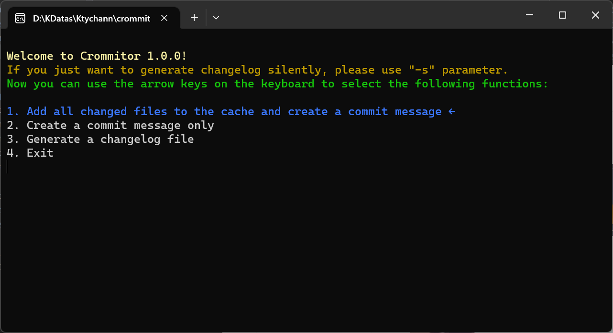
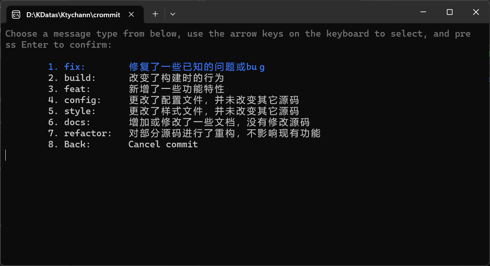

<p align=center><b>简介</b></p>
<p align=center>本程序的核心功能是生成changelog，也围绕该功能包含了一些辅助性的git功能</p>
<p align=center>这个仓库的名字怎么叫crommitor？</p>
<p align=center>不必在意，起名向来是个令人头疼的事，而且这只是一个控制台程序，所以完全没必要在乎这仓库的名字。</P>
<p align=center>为什么要开发这个小工具？常规的changelog生成工具用起来感觉不是很好用，格式也和自己所想的有所差距，因此写了这个小工具。</p>

<hr>

## 参数

这个exe文件可以接受以下参数：

    [options]    [params] <optional> description

    -c           [config file path] <?> support relative path & absolute path.
                 By default, query the config file named csogrc.yml in the directory
                 where the exe file is located. A changelog will be generated based on
                 the configuration file. At the same time, this configuration file
                 is also used by other functions, please refer to the configuration file
                 tutorial for more details.
    -s           If you only want to generate a changelog file, you can append this command,
                 then it will be executed silently, and the cmd window will no longer pop up.
    -v           Show the version.
    -h, --help   Show the help info.

## 配置

默认情况下我们使用主程序所在目录（简称根目录）下的`csogrc.yml`作为程序的配置文件，当您使用 `-c`
参数时，您指定的配置文件将被指定为有效配置文件，下面是关于该配置文件的示例及描述。

### 一个完整的示例文件

```yml
useplatform: gitlab
projpath: E:\Projects\vsapps\commitor
branch: origin/main
description: 这是一个changelog
title: ChangeLog Title
committypes:
  - value: fix
    description: 修复了一些已知的问题或bug
  - value: build
    description: 改变了构建时的行为
  - value: feat
    description: 新增了一些功能特性
  - value: config
    description: 更改了配置文件，并未改变其它源码
  - value: style
    description: 更改了样式文件，并未改变其它源码
  - value: docs
    description: 增加或修改了一些文档，没有修改源码
  - value: refactor
    description: 对部分源码进行了重构，不影响现有功能
onlyusers:
  - value: kamikisho
    description: null
outputdir: ./changelog.md
```

### 字段含义

| Field                      | Type                      | Description                                                                         |
|----------------------------|---------------------------|-------------------------------------------------------------------------------------|
| branch                     | `string`                  | branch name                                                                         |
| committypes                | `<{value,description}>[]` |                                                                                     |
| committypes[i].value       | `string`                  | type string                                                                         |
| committypes[i].description | `string`                  | type info                                                                           |
| description                | `string`                  | changelog info                                                                      |
| onlyusers                  | `<{value,description}>[]` | If this property is not empty, only read the commit information of the listed users |
| onlyusers[i].value         | `string`                  | username                                                                            |
| onlyusers[i].description   | `string`                  | user info                                                                           |
| outputdir                  | `string`                  | output path                                                                         |
| projpath                   | `string`                  | project path                                                                        |
| title                      | `string`                  | changelog title                                                                     |
| useplatform                | `string`                  | The code hosting platform you use, currently we support gitlab, gitee, github       |

## 对比其他工具

#### cz-git

我在日常工作中主要的技术栈是前端，因此会经常使用到node、yarn等开发工具，因此早期使用的规范提交工具是[cz-git](https://cz-git.qbb.sh/zh/)
，但是对于那些不想使用或无需使用node的用户来说，使用cz-git不仅需要下载Nodejs，还要使用自己不熟悉的npm工具未免有些不友好；除此之外，要想生成一个规范的changelog文档
还要下载其他的工具来协助搭配使用，而这些工具有时有需要特定的运行时环境，因此还必须得为这些工具安装合适的环境，非常的耗时间，
如果定义了第三方工具不支持的前缀还无法生成自己想要的changelog，因此在这个小工具中我们将提交、日志生成集成到了一起，致力于节省您在项目中的时间。

在这个小工具中我们还特意考虑到了一种情况，试想您的项目一直是在develop分支上进行，用于生成changelog的配置文件读取的是main分支，
但是tag标签只会在将develop分支合并到main分支之后才打到main分支上，
因此如果您想生成一个带有即将发布的新版本号的changelog，您只能在合并main后再进行读取生成，可是这样会与“main分支上不得直接创建提交信息”的工作方式相悖，
因此，我们允许您在生成一个changelog前指定一个近期待发布的版本号，这样您就可以在正式发布前就拥有较新的changelog。

然而，如果您的tag都打在main上，这意味着develop分支上没有任何tag，此时如果您指定读取develop上的提交信息来生成日志文件的话，
这可能会导致最后的输出只有您定义的一个tag，对此我们暂未想出什么特别好的方案，如果您有好的想法欢迎您向我们报告issue。

## 使用截图




## 近期计划（可能）

- install & uninstall

## License

[MIT](https://opensource.org/licenses/MIT)

Copyright (c) 2023-present, kuyoru-kamikisyo